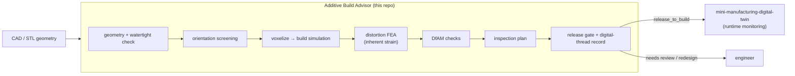

# Additive Build Advisor

A design-to-inspection **digital thread** for additive manufacturing. It takes a
part geometry (STL), decides how to build it, simulates the build, runs a
finite-element **distortion analysis**, checks whether the part can actually be
made and measured, and emits one auditable record with an explicit **release
gate** — `release_to_build`, `needs_engineering_review`, or `redesign_required`.

For the full technical write-up — the FEA formulation, validation, and honest
limits — see [REPORT.md](REPORT.md).

## What it does

Given an STL and a target process, the advisor runs the workflow a build-prep
engineer runs before committing a build:

1. **Recover the geometry** — parse the STL from scratch, recompute normals from
   winding, and check the mesh is watertight before trusting it.
2. **Choose an orientation** — screen "rest on a flat face" orientations (the
   part's own flat faces plus the bounding-box directions) and score each on
   *actual support volume*, base-contact area, and build height.
3. **Simulate the build** — voxelize the part by ray-stabbing, then estimate
   layer count, support volume, build time, material, and cost.
4. **Analyze distortion (FEA)** — a linear-elastic finite-element solve using the
   **inherent-strain method**, assembled and solved with **scikit-fem** on a
   hexahedral mesh: each element carries a thermal eigenstrain, the base is
   clamped to the plate, and the distortion field is solved. This is what tools
   like Netfabb / ANSYS Additive do for fast distortion screening.
5. **Check manufacturability (DfAM)** — thin walls, support burden, aspect ratio,
   distortion, and trapped powder/resin (enclosed voids found by flood fill).
6. **Plan inspection** — turn the part's tolerances into a first-article
   inspection plan, flagging tolerances the process cannot hold as-built.
7. **Gate the release** — assemble a machine-readable digital-thread record and
   decide whether the build can proceed, with the reasons attached.

The geometry kernel, STL parser, voxelizer, orientation search, and build
simulation are written from first principles on top of `numpy` (no CAD kernel),
so those decisions are legible. The distortion FEA is assembled and solved with
**scikit-fem** (a real finite-element library, on `scipy`) — the credible choice
for the one piece that genuinely warrants an established solver. `matplotlib`
renders the report.

## Where this sits: the digital thread

This is the **front half** of a digital thread — design intent flowing into a
build decision. It is built to hand off to a companion project,
`mini-manufacturing-digital-twin`, which is the **back half**: runtime
monitoring of the part once it is on the machine. The release gate's output
(machine id, part id, expected layers/time, and the signals to watch) becomes
that twin's as-built monitoring context.




## Quickstart

Python 3.9+; depends on `numpy`, `scipy`, `scikit-fem`, and `matplotlib`.

```bash
pip install -r requirements.txt

# 1) generate the self-contained sample parts (writes data/*.stl)
python examples/make_sample_parts.py

# 2) run the three demo scenarios (writes output/<part>__<process>/report.html)
python examples/run_example.py

# 3) (optional) reproduce the FEA validation figure
python examples/validate_fea.py
```

Or run a single part through the CLI:

```bash
pip install -e .            # exposes the `build-advisor` command
build-advisor data/gantry_bracket.stl --process lpbf_ti64 \
    --tolerances examples/tolerances_bracket.json --out output/

build-advisor --list-processes
```

Each run writes a `digital_thread.json` record and a self-contained
`report.html` (figures embedded as base64).

## What a run produces

| Orientation screening | Part in chosen orientation | Distortion FEA (deformed mesh) |
|---|---|---|
|  |  |  |

The orientation step rests the bracket on its large flat back face (full base
contact, **zero support**); the FEA panel is the **deformed element mesh**
(exaggerated for visibility, contour-colored by displacement) — near zero at the
clamped base and rising toward the free corners, the corner-lift that drives real
additive distortion.

## Target process & method basis

The distortion analysis targets **metal laser powder-bed fusion (LPBF)**, where
residual-stress warpage governs. It uses the **inherent-strain method** — apply a
calibrated thermal eigenstrain as a static load to a part-scale linear-elastic
FEA — which is the accepted reduced-order approach in the field (Netfabb, ANSYS
Additive; see the review in *Int. J. Adv. Manuf. Technol.* 2022) and is validated
against the recognized **NIST AM-Bench 2018** cantilever/bridge artifact.

This implementation is a faithful *simplified* version: a representative isotropic
eigenstrain (not a calibrated anisotropic tensor), applied to the whole part at
once, with the part **bonded to the plate**. So the reported distortion is the
*on-plate* field — useful as a relative warpage screen. It is deliberately **not**
the post-release deflection NIST measures after cutting the part free (~1–1.3 mm
for the IN625 cantilever); reproducing that needs a release/cutting step and a
calibrated inherent strain, which the report lists as the next step. For polymer
processes the same solver runs but the result is only an indicative shrinkage
tendency.

## Sample results

The example runner exercises all three gate outcomes (numbers from a real run):

| Part | Process | Build time | Cost | FEA distortion | DfAM | Gate |
|---|---|--:|--:|--:|---|---|
| calibration_cube | FFF (PLA) | 0.71 h | $3.79 | 0.158 mm | ok | **release_to_build** |
| gantry_bracket | FFF (PLA) | 0.80 h | $4.24 | 0.302 mm | ok | **needs_engineering_review** |
| hollow_housing | SLA (resin) | 1.94 h | $17.16 | 0.101 mm | critical | **redesign_required** |

- The **bracket** prints cleanly, but a ±0.05 mm tolerance and a 3.2 µm finish
  are below FFF as-built capability, so it is routed to engineering review for
  post-machining rather than released.
- The **housing** has a fully enclosed cavity; on SLA that traps resin, so it is
  blocked for redesign (add drain holes).

## Validation

Two engines are validated against ground truth, and the report surfaces both:

- **Voxel volume** vs analytic geometry: an axis-aligned cube discretizes
  exactly, an off-axis rotated part converges to within ~0.1%, a known enclosed
  cavity is recovered to within ~2%.
- **Distortion FEA** vs the analytical clamped-bar solution (top displacement
  = |eigenstrain|·height): the FEA converges to it under mesh refinement, and
  predicted distortion scales **linearly with eigenstrain** and is independent of
  Young's modulus — exactly as linear-elastic theory requires for an
  eigenstrain-only load.


## Project structure

```text
additive-build-advisor/
  src/abadvisor/
    stl_io.py          # STL read/write (binary + ASCII), from scratch
    geometry.py        # mesh metrics, normals, watertight check, transforms
    voxelize.py        # ray-stabbing voxelization + support/thin-wall/trapped analyses
    orientation.py     # rest-on-face orientation screening (support + contact + height)
    am_sim.py          # build simulation: layers, support, time, cost
    fea.py             # inherent-strain linear-elastic FEM (scikit-fem hex + SciPy)
    dfam.py            # design-for-additive-manufacturing checks
    inspection.py      # tolerance spec -> inspection plan + capability check
    digital_thread.py  # record assembly + release gate + JSON
    report.py          # matplotlib figures + self-contained HTML
    materials.py       # process/material library (FFF, SLA, SLS, LPBF) incl. elastic props
    shapes.py          # parametric sample-part generator
    pipeline.py        # end-to-end orchestration
    cli.py             # command-line entry point
  examples/            # sample parts, tolerance specs, demo runner, FEA validation, diagram generator
  data/                # generated sample STLs
  tests/               # smoke + validation tests (pytest or `python tests/test_smoke.py`)
```

## Honest scope

This is a compact prototype that demonstrates the workflow and the engineering
judgment, not a production build processor. The voxel model is reduced-order;
the distortion FEA is a genuine linear-elastic solve but uses the **inherent-
strain method with representative per-process eigenstrains**, not a melt-pool-
calibrated transient thermo-mechanical solve; and the material/machine numbers
are representative defaults, not OEM-qualified profiles. REPORT.md lists exactly
what a production version would add — a proper slicer, a calibrated transient
thermo-mechanical solver, qualified process profiles, and a real CAD/CAM
integration (e.g., Fusion or STEP) feeding the same record schema.

## License

MIT — see [LICENSE](LICENSE).
