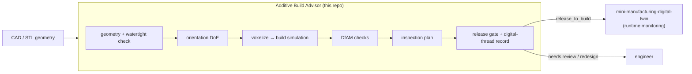
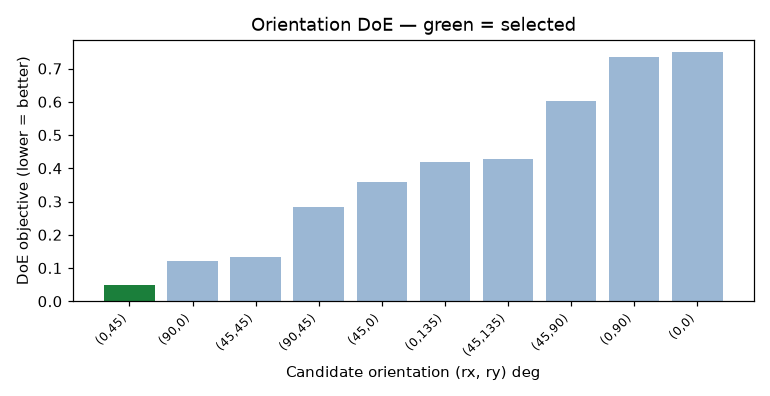

# Additive Build Advisor

A design-to-inspection **digital thread** for additive manufacturing. It takes a
part geometry (STL), decides how to build it, simulates the build, checks
whether it can actually be made and measured, and emits one auditable record
with an explicit **release gate** — `release_to_build`, `needs_engineering_review`,
or `redesign_required`.

For the full technical write-up — engine validation, the warpage model, and
honest limits — see [REPORT.md](REPORT.md).

## What it does

Given an STL and a target process, the advisor runs the workflow a build-prep
engineer runs before committing a build:

1. **Recover the geometry** — parse the STL from scratch, recompute normals from
   winding, and check the mesh is watertight before trusting it.
2. **Choose an orientation** — a small design-of-experiments (DoE) sweep scores
   candidate orientations on support area, build height, and stability.
3. **Simulate the build** — voxelize the part by ray-stabbing, then estimate
   layer count, support volume, build time, material, cost, and a reduced-order
   warpage-risk index.
4. **Check manufacturability (DfAM)** — thin walls, support burden, aspect ratio,
   and trapped powder/resin (enclosed voids found by flood fill).
5. **Plan inspection** — turn the part's tolerances into a first-article
   inspection plan, picking measurement methods and flagging tolerances the
   process cannot hold as-built.
6. **Gate the release** — assemble a machine-readable digital-thread record and
   decide whether the build can proceed, with the reasons attached.

The geometry, voxelization, DoE, and build simulation are written from first
principles on top of `numpy` — no CAD kernel — so every engineering decision is
readable and defensible. `matplotlib` only renders the report.

## Where this sits: the digital thread

This is the **front half** of a digital thread — design intent flowing into a
build decision. It is built to hand off to a companion project,
`mini-manufacturing-digital-twin`, which is the **back half**: runtime
monitoring of the part once it is on the machine. The release gate's output
(machine id, part id, expected layers/time, and the signals to watch) becomes
that twin's as-built monitoring context.



## Quickstart

Python 3.9+; depends only on `numpy` and `matplotlib`.

```bash
pip install -r requirements.txt

# 1) generate the self-contained sample parts (writes data/*.stl)
python examples/make_sample_parts.py

# 2) run the three demo scenarios (writes output/<part>__<process>/report.html)
python examples/run_example.py
```

Or run a single part through the CLI:

```bash
pip install -e .            # exposes the `build-advisor` command
build-advisor data/gantry_bracket.stl --process lpbf_ti64 \
    --tolerances examples/tolerances_bracket.json --out output/

build-advisor --list-processes
```

Each run writes a `digital_thread.json` record and a self-contained
`report.html` (figures embedded as base64).

## What a run produces

Every run writes a self-contained `report.html`. A few of its figures, for the
sample bracket on FFF:

| Orientation DoE | Part in chosen orientation | Per-layer cross-section |
|---|---|---|
|  |  |  |

The DoE selects the green orientation (a 45° tilt that takes the flange's flat
overhang to zero); the layer plot is the simulated cross-section vs build height,
with support shaded.

## Sample results

The example runner exercises all three gate outcomes (numbers from a real run):

| Part | Process | Build time | Cost | Warpage | DfAM | Gate |
|---|---|--:|--:|--:|---|---|
| calibration_cube | FFF (PLA) | 0.78 h | $4.16 | 14 | ok | **release_to_build** |
| gantry_bracket | FFF (PLA) | 1.04 h | $5.55 | 21 | ok | **needs_engineering_review** |
| hollow_housing | SLA (resin) | 2.57 h | $22.32 | 10 | critical | **redesign_required** |

- The **bracket** prints cleanly, but a ±0.05 mm tolerance and a 3.2 µm finish
  are below FFF as-built capability, so it is routed to engineering review for
  post-machining rather than released.
- The **housing** has a fully enclosed cavity; on SLA that traps resin, so it is
  blocked for redesign (add drain holes).

## Why this fits Autodesk Research

The Manufacturing Industry Futures role is about connecting **design,
simulation, fabrication, and inspection** with practical AI and a digital
thread. This prototype is intentionally small but reflects that loop end to end:
geometry in, a model-based build simulation, manufacturability and inspection
reasoning, and a gated, auditable decision that flows downstream to runtime
monitoring. It leans on the manufacturing fundamentals the role cares about —
additive process physics (overhangs, support, warpage), DfAM, GD&T, and
process capability — rather than a black-box model.

## Engine validation

A simulation is only as trustworthy as its discretization, so the voxel engine
is validated against analytic geometry: an axis-aligned cube discretizes to its
exact volume, an off-axis rotated part converges to within ~0.1%, and a known
enclosed cavity is recovered to within ~2%. The volume error is reported in
every run, and a large error pulls the gate's simulation-confidence down. See
[REPORT.md](REPORT.md#engine-validation).

## Project structure

```text
additive-build-advisor/
  src/abadvisor/
    stl_io.py          # STL read/write (binary + ASCII), from scratch
    geometry.py        # mesh metrics, normals, watertight check, transforms
    voxelize.py        # ray-stabbing voxelization + support/thin-wall/trapped analyses
    orientation.py     # DoE orientation optimizer
    am_sim.py          # build simulation: layers, support, time, cost, warpage
    dfam.py            # design-for-additive-manufacturing checks
    inspection.py      # tolerance spec -> inspection plan + capability check
    digital_thread.py  # record assembly + release gate + JSON
    report.py          # matplotlib figures + self-contained HTML
    materials.py       # process/material library (FFF, SLA, SLS, LPBF)
    shapes.py          # parametric sample-part generator
    pipeline.py        # end-to-end orchestration
    cli.py             # command-line entry point
  examples/            # sample-part generator, tolerance specs, demo runner
  data/                # generated sample STLs
  tests/               # smoke + validation tests (pytest or `python tests/test_smoke.py`)
```

## Honest scope

This is a compact prototype that demonstrates the workflow and the engineering
judgment, not a production build processor. The voxel model is reduced-order;
the warpage index is an explicit heuristic, not FEA; and the material/machine
numbers are representative defaults, not OEM-qualified profiles. REPORT.md lists
exactly what a production version would add — a proper slicer, a thermo-mechanical
solver, qualified process profiles, and a real CAD/CAM integration (e.g., Fusion
or STEP) feeding the same record schema.

## License

MIT — see [LICENSE](LICENSE).
