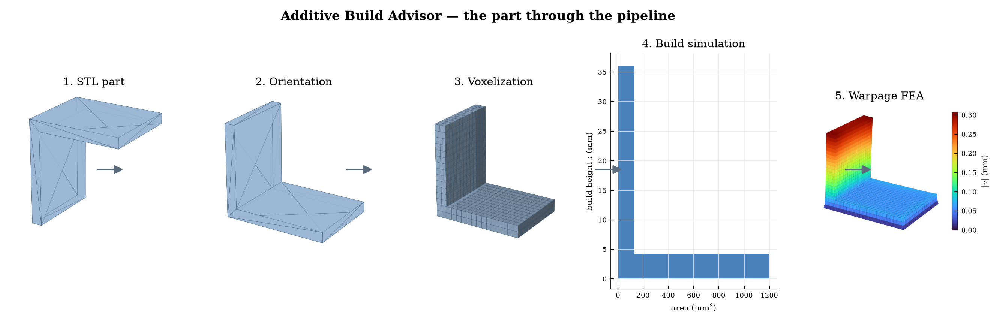
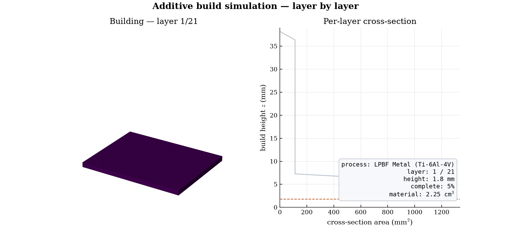
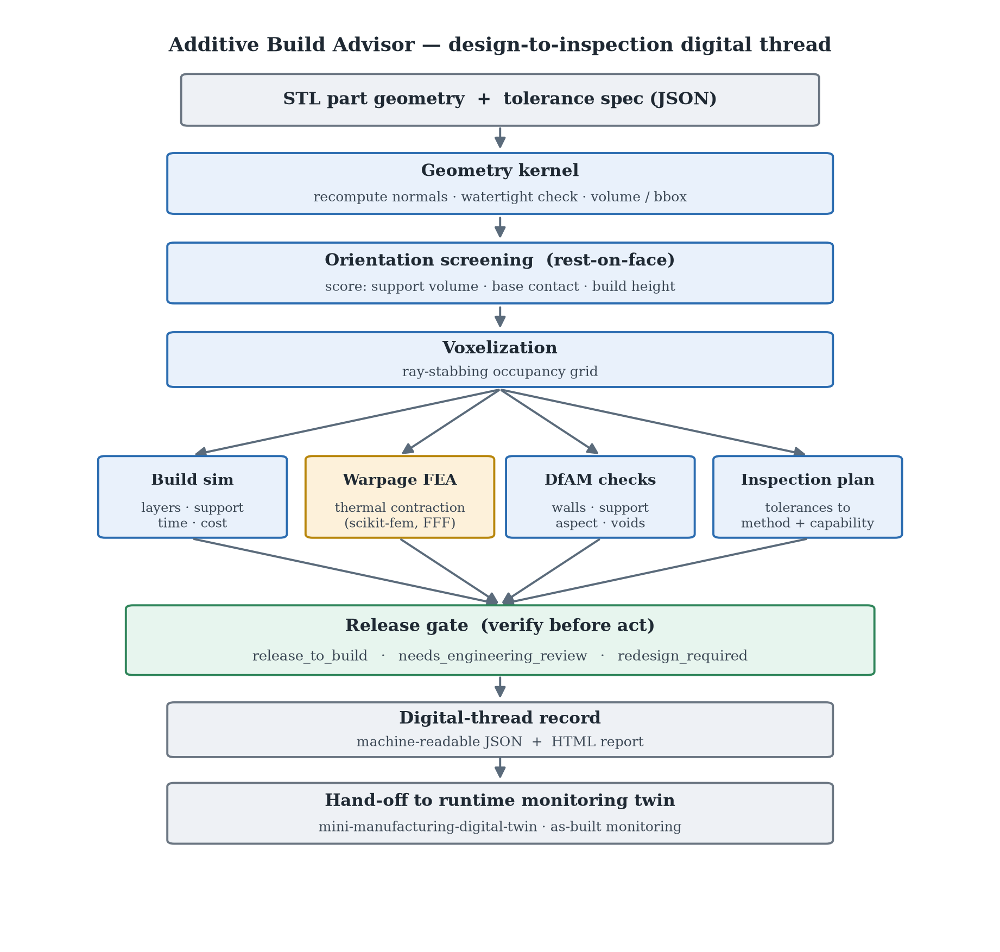
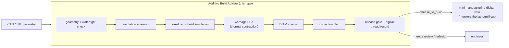
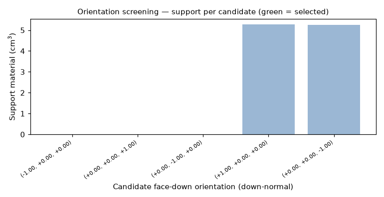
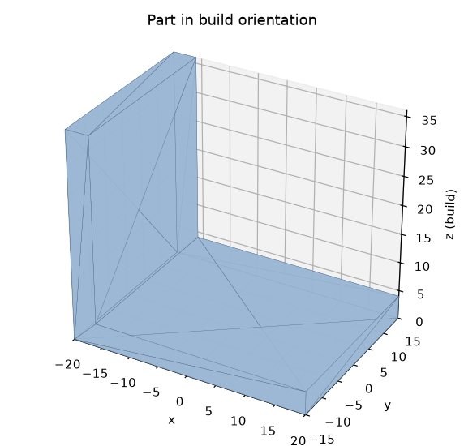
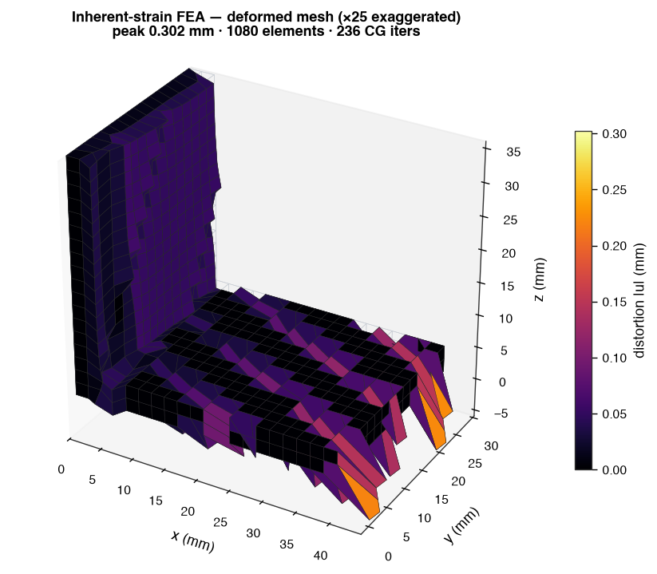
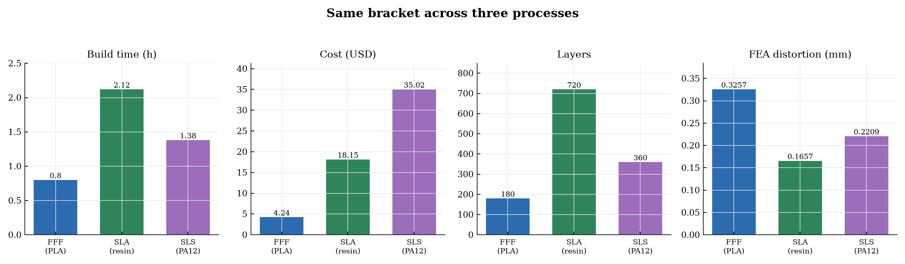
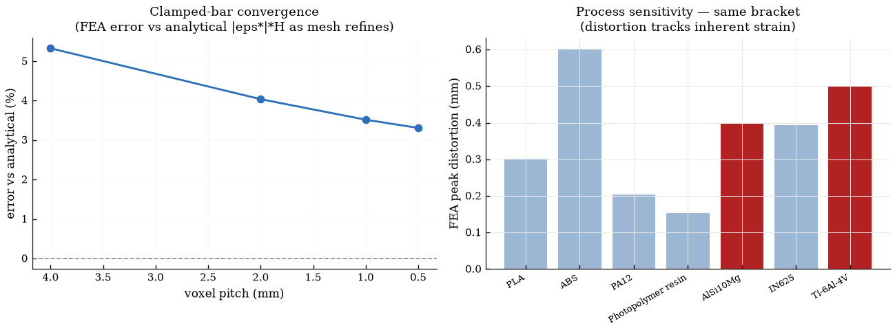

# Additive Build Advisor

A design-to-inspection **digital thread** for additive manufacturing, with
**fused filament fabrication (FFF)** as the home process. It takes a part
geometry (STL), decides how to build it, simulates the build, runs a
finite-element **warpage analysis**, checks whether the part can actually be made
and measured, and emits one auditable record with an explicit **release gate** —
`release_to_build`, `needs_engineering_review`, or `redesign_required`.

I teach **ES 51, Computer-Aided Machine Design**, at Harvard SEAS, where students
design a part in CAD, FFF-print it, and then machine features on the lathe and
mill. I built this as a teaching demo to make the *design → make → inspect*
decisions legible: where do you rest the part on the bed, how long and how much
does it cost, will it warp off the bed, which tolerances can FFF actually hold
as-built (and which features have to be finished on the mill), and is it cleared
to print. It is a clean base I keep extending.



And the build, simulated layer by layer:



For the full technical write-up — the FEA formulation, equations, validation, and
honest limits — see [REPORT.md](REPORT.md).

## What it does

Given an STL and a target process, the advisor runs the workflow a build-prep
engineer runs before committing a build:

1. **Recover the geometry** — parse the STL from scratch, recompute normals from
   winding, and check the mesh is watertight before trusting it.
2. **Choose an orientation** — screen "rest on a flat face" orientations (the
   part's own flat faces plus the bounding-box directions) and score each on
   *actual support volume*, base-contact area, and build height.
3. **Simulate the build** — voxelize the part by ray-stabbing, then estimate
   layer count, support volume, build time, material, and cost.
4. **Analyze warpage (FEA)** — a linear-elastic finite-element solve for the
   **thermal-contraction warping** that curls FFF parts off the bed, assembled
   and solved with **scikit-fem** on a hexahedral mesh: each element carries a
   thermal-contraction eigenstrain (the part shrinks as it cools, `ε* ≈ −α·ΔT`),
   the first layer is clamped to the bed (the bed-adhesion constraint), and the
   distortion field is solved — the corner-lift that lifts FFF parts off the bed.
5. **Check manufacturability (DfAM)** — thin walls, support burden, aspect ratio,
   distortion, and trapped powder/resin (enclosed voids found by flood fill).
6. **Plan inspection** — turn the part's tolerances into a first-article
   inspection plan, flagging tolerances the process cannot hold as-built.
7. **Gate the release** — assemble a machine-readable digital-thread record and
   decide whether the build can proceed, with the reasons attached.

The geometry kernel, STL parser, voxelizer, orientation search, and build
simulation are written from first principles on top of `numpy` (no CAD kernel),
so those decisions are legible. The distortion FEA is assembled and solved with
**scikit-fem** (a real finite-element library, on `scipy`) — the credible choice
for the one piece that genuinely warrants an established solver. `matplotlib`
renders the report.

## Where this sits: the digital thread

This is the **front half** of a digital thread — design intent flowing into a
build decision. It is built to hand off to a companion project,
`mini-manufacturing-digital-twin`, which is the **back half**: runtime
monitoring of the part once it is on a machine. That matches how the ES 51 lab
actually runs — students print the part, then take it to the lathe or mill to
machine the features FFF cannot hold (the ones this tool flags for
post-machining). The release gate's output (part id, expected build, the
tolerances that need machining, and the signals to watch) becomes the twin's
as-built monitoring context for that cut.





## Quickstart

Python 3.9+; depends on `numpy`, `scipy`, `scikit-fem`, and `matplotlib`.

```bash
pip install -r requirements.txt

# 1) generate the self-contained sample parts (writes data/*.stl)
python examples/make_sample_parts.py

# 2) run the demo scenarios (writes output/<part>__<process>/report.html)
python examples/run_example.py

# 3) (optional) reproduce the FEA validation figure
python examples/validate_fea.py
```

Or run a single part through the CLI (FFF is the default process):

```bash
pip install -e .            # exposes the `build-advisor` command
build-advisor data/gantry_bracket.stl --process fff_pla \
    --tolerances examples/tolerances_bracket.json --out output/

build-advisor --list-processes
```

Each run writes a `digital_thread.json` record and a self-contained
`report.html` (figures embedded as base64).

## Interactive web app

The same pipeline is wrapped in a guided browser front-end
([`streamlit_app.py`](streamlit_app.py)): pick a sample part (or upload an STL),
choose a process, and step the part through the whole *design → build → inspect →
decide* thread — an interactive 3-D input mesh, an orientation comparison, a
layer-by-layer build explorer, a live warpage-exaggeration slider on the FEA
field, severity-colored DfAM / inspection tables, and the release-gate verdict —
with the actual pipeline outputs at every stage.

```bash
pip install -r requirements.txt   # needs streamlit>=1.37 (partial reruns) + plotly
streamlit run streamlit_app.py
```

It also deploys on Streamlit Community Cloud straight from this repo: the entry
point is `streamlit_app.py`, dependencies come from `requirements.txt`, and the
theme is set in `.streamlit/config.toml`. If `plotly` is unavailable the app
falls back to the static matplotlib report figures.

## What a run produces

| Orientation screening | Part in chosen orientation | Warpage FEA (deformed mesh) |
|---|---|---|
|  |  |  |

The orientation step rests the bracket on its large flat back face (full base
contact, **zero support**); the FEA panel is the **deformed element mesh**
(exaggerated for visibility, contour-colored by displacement) — near zero at the
bed-clamped base and rising toward the free corners, the corner-lift that warps
FFF parts off the bed.

## Process focus & method basis

The warpage analysis is built around **fused filament fabrication (FFF)**. As
each extruded road cools from the printing temperature it contracts; the
already-solid material below resists that shrinkage, residual stress builds, and
the part curls up off the bed at its corners — the warping every FFF user fights,
worst on large flat footprints and far worse for ABS than PLA. The solver lumps
that cooling into one effective **thermal-contraction eigenstrain**
(`ε* ≈ −α·ΔT`), applies it as a static load to a part-scale linear-elastic FEA,
and clamps the first layer to the bed (the bed-adhesion constraint).

That reduced-order recipe — lump the cooling into one effective contraction
strain and apply it as a static eigenstrain load to a part-scale elastic FEA — is
a standard way to screen build warpage without a full transient thermo-mechanical
solve.

It is a *simplified* model: one representative isotropic contraction strain (not
a tensor fit to a measured cooling history), applied to the whole part at once,
with the base bonded to the bed. So the reported distortion is the **on-bed**
field — a relative warpage screen — not the spring-back after the part is peeled
off the bed. It is validated against the analytical clamped-bar solution.

## Cross-process comparison

The build simulation, cost/time, DfAM, and warpage FEA run natively for every
process. FFF is the home process; SLA and SLS are shown as a cross-process
comparison. Running the **same bracket** through three additive processes:



| Process | Build time | Cost | Layers | Warpage FEA |
|---|--:|--:|--:|--:|
| FFF (PLA) | 0.80 h | $4.24 | 180 | 0.326 mm |
| SLA (resin) | 2.12 h | $18.15 | 720 | 0.166 mm |
| SLS (PA12) | 1.38 h | $35.02 | 360 | 0.221 mm |

FFF is the fastest and cheapest; SLA gives the finest layers; SLS is the priciest
here (PA12 powder plus machine rate). Predicted warpage scales with each process's
representative contraction strain (and is independent of Young's modulus) — so
among these PLA warps the most and SLA the least, and ABS (not shown) would warp
more still, as it does in practice.

## Sample results

The example runner exercises all three gate outcomes (numbers from a real run):

| Part | Process | Build time | Cost | Warpage FEA | DfAM | Gate |
|---|---|--:|--:|--:|---|---|
| calibration_cube | FFF (PLA) | 0.71 h | $3.79 | 0.158 mm | ok | **release_to_build** |
| gantry_bracket | FFF (PLA) | 0.80 h | $4.24 | 0.311 mm | ok | **needs_engineering_review** |
| hollow_housing | SLA (resin) | 1.94 h | $17.16 | 0.102 mm | critical | **redesign_required** |

- The **bracket** prints cleanly, but a ±0.05 mm tolerance and a 3.2 µm finish
  are below FFF as-built capability, so it is routed to engineering review to
  finish those features on the mill rather than released as-printed — exactly the
  call the ES 51 lab makes.
- The **housing** has a fully enclosed cavity; on SLA that traps resin, so it is
  blocked for redesign (add drain holes).

## Validation

Two engines are validated against ground truth, and the report surfaces both:

- **Voxel volume** vs analytic geometry: an axis-aligned cube discretizes
  exactly, an off-axis rotated part converges to within ~0.1%, a known enclosed
  cavity is recovered to within ~2%.
- **Warpage FEA** vs the analytical clamped-bar solution (top displacement
  = |contraction strain|·height): the FEA converges to it under mesh refinement,
  and predicted distortion scales **linearly with the contraction strain** and is
  independent of Young's modulus — exactly as linear-elastic theory requires for
  an eigenstrain-only load.



## Project structure

```text
additive-build-advisor/
  src/abadvisor/
    stl_io.py          # STL read/write (binary + ASCII), from scratch
    geometry.py        # mesh metrics, normals, watertight check, transforms
    voxelize.py        # ray-stabbing voxelization + support/thin-wall/trapped analyses
    orientation.py     # rest-on-face orientation screening (support + contact + height)
    am_sim.py          # build simulation: layers, support, time, cost
    fea.py             # thermal-contraction (eigenstrain) linear-elastic FEM (scikit-fem hex + SciPy)
    dfam.py            # design-for-additive-manufacturing checks
    inspection.py      # tolerance spec -> inspection plan + capability check
    digital_thread.py  # record assembly + release gate + JSON
    report.py          # matplotlib figures + self-contained HTML
    materials.py       # process/material library (FFF, SLA, SLS) incl. elastic + contraction props
    shapes.py          # parametric sample-part generator
    pipeline.py        # end-to-end orchestration
    cli.py             # command-line entry point
  examples/            # sample parts, tolerance specs, demo runner, FEA validation, figure + PDF generators
  data/                # generated sample STLs
  tests/               # smoke + validation tests (pytest or `python tests/test_smoke.py`)
```

## Honest scope

This is a compact teaching prototype that demonstrates the workflow and the
engineering judgment, not a production build processor. The voxel model is
reduced-order; the warpage FEA is a genuine linear-elastic solve but uses a
**representative per-process contraction strain**, not a solve fit to a measured
cooling history; and the material/machine numbers are representative defaults,
not vendor-qualified profiles. REPORT.md lists exactly what a production version
would add — a proper slicer, a calibrated transient thermo-mechanical solver,
qualified process profiles, and a real CAD/CAM integration (e.g., Fusion or STEP)
feeding the same record schema.

## License

MIT — see [LICENSE](LICENSE).
