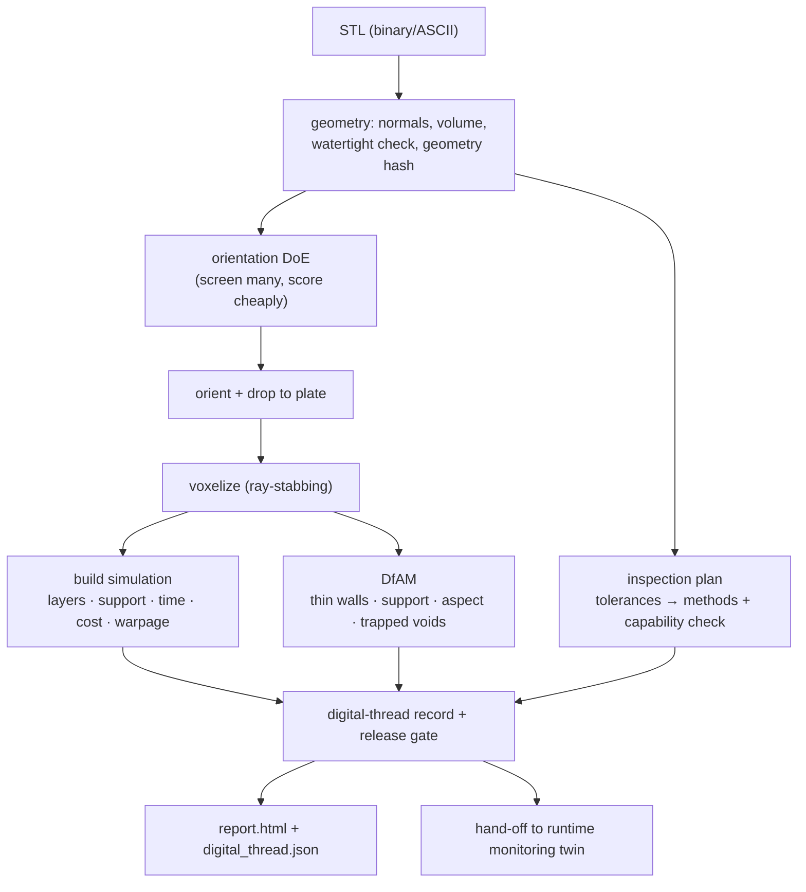

# Technical Report: Additive Build Advisor

## Executive summary

The Additive Build Advisor is a compact, design-to-inspection digital thread for
additive manufacturing. It ingests a part as an STL mesh, recovers a clean
geometry, chooses a build orientation through a design-of-experiments sweep,
simulates the build on a voxel model, checks manufacturability, turns the part's
tolerances into an inspection plan, and assembles a single machine-readable
record with an explicit release gate.

The goal is not to be a production build processor. It is to demonstrate the
engineering workflow behind one, end to end and from first principles:

1. Recover geometry you can trust (parse, re-normal, verify watertightness).
2. Make the highest-leverage decision (orientation) as a small DoE.
3. Simulate the build on a model you can *validate* against analytic volume.
4. Decide manufacturability with transparent DfAM rules.
5. Connect design tolerances to a concrete, capability-aware inspection plan.
6. Gate the physical action — release, review, or redesign — with the reasons.

This maps directly to the manufacturing-R&D loop of connecting design,
simulation, fabrication, and inspection, with a human-in-the-loop decision at
the end.

## Why this project

It fills a specific gap: a runnable artifact that shows the **front half of the
digital thread** — design intent turning into a build decision — grounded in
real additive-manufacturing physics (overhangs, support, warpage, DfAM, process
capability) rather than a generic ML demo. It is built to hand off to a separate
runtime-monitoring twin (`mini-manufacturing-digital-twin`), so the two together
span design → build → monitor.

The package depends only on `numpy` (math) and `matplotlib` (report figures).
The STL parser, geometry kernel, voxelizer, orientation DoE, and build
simulation are all written from scratch so the engineering is legible.

## System architecture



| Component | File | Role |
|---|---|---|
| STL I/O | `stl_io.py` | Parse/write binary + ASCII STL; treat file normals as untrusted. |
| Geometry | `geometry.py` | Recomputed normals, area, signed volume, COM, bbox, watertight check, transforms, geometry hash. |
| Voxelizer | `voxelize.py` | Ray-stabbing occupancy grid; support, thin-wall (morphological opening), and trapped-void (flood fill) analyses. |
| Orientation | `orientation.py` | DoE sweep scored on overhang area, height, and stability. |
| Build sim | `am_sim.py` | Layers, support volume, build time, material, cost, reduced-order warpage index. |
| DfAM | `dfam.py` | Manufacturability findings with severities. |
| Inspection | `inspection.py` | Tolerance spec → first-article plan + as-built capability check. |
| Digital thread | `digital_thread.py` | Record assembly + release gate + JSON. |
| Report | `report.py` | Figures + self-contained HTML. |
| Materials | `materials.py` | Process/material library (FFF, SLA, SLS, LPBF). |

## The simulation core: ray-stabbing voxelization

A triangle soup is not a solid model — you cannot ask "how much material is at
this height" without one. The advisor builds an occupancy grid by *ray
stabbing*: for each (x, y) column it shoots a vertical ray, collects where the
ray crosses the mesh, sorts the crossings, and fills voxels between entry/exit
pairs (the even-odd rule). Two robustness details matter and are handled
explicitly:

- **Per-axis grid jitter.** Equal offsets in x and y would keep sample points on
  the `y = x` diagonal that splits an axis-aligned face into two triangles,
  double-counting crossings there. Distinct per-axis offsets break that.
- **Coincident-crossing de-duplication.** A ray that lands on a shared edge hits
  two facets at the same height; collapsing coincident crossings keeps the
  even-odd pairing correct.
- **Center sampling in z.** A voxel is solid iff its *center* lies inside a span,
  the same rule used in x and y, which makes the discretized volume unbiased.

From the grid we derive support, thin walls, trapped voids, and the per-layer
cross-section profile.

## Engine validation

A simulation is only as good as its discretization, so the engine is validated
against geometry with known answers. The voxel/mesh volume error is reported in
every run and feeds the gate's simulation-confidence.

**Axis-aligned cube (analytic volume 1000 mm³ for a 10 mm cube)** — lands exactly
on the grid, so the discretization is exact at every resolution:

| grid_n | voxel volume | error |
|---:|---:|---:|
| 16 | 1000.00 | 0.00% |
| 32 | 1000.00 | 0.00% |
| 64 | 1000.00 | 0.00% |

**Off-axis rotated bracket (analytic volume 8640 mm³)** — no longer grid-aligned,
so it converges rather than being exact, staying under ~0.4% even when coarse:

| grid_n | voxel volume | error |
|---:|---:|---:|
| 24 | 8655.6 | +0.18% |
| 32 | 8610.1 | −0.35% |
| 48 | 8642.3 | +0.03% |
| 96 | 8638.4 | −0.02% |

**Enclosed-cavity box** — a solid cube reports zero trapped volume and zero
support (as it must); a hollow box with a 216 mm³ internal void recovers ~220 mm³
of trapped volume by flood fill. The trapped-void and support estimates are
therefore consistent with the volume model.

## Orientation as a design-of-experiments sweep

Orientation is the single highest-leverage additive decision: it sets support
volume, build height (hence time), stability, and surface quality. The advisor
treats it as a small full-factorial DoE over two rotation factors and scores
every candidate on a transparent weighted objective (support 0.50, height 0.30,
stability 0.20), with a hard penalty for orientations that exceed the build
volume.

Scoring uses only cheap analytic facet metrics, so the whole design space is
screened quickly; the expensive voxel simulation runs once, on the winner. On
the sample bracket, the DoE selects a 45° tilt that lifts the flange's flat
underside to the self-support angle, taking the support overhang area to zero —
the optimizer recovers the same move a build-prep engineer would make by hand.

## Build simulation and the warpage model

From the oriented mesh and grid, the simulation estimates layer count (from the
real layer height), support material (support infill × the empty volume that
sits under solid), build time (deposition time + per-layer recoat/peel
overhead), and cost (material + amortized machine time). These scale correctly
across processes: the same bracket is 156 layers and ~$5.50 on FFF but 1038
layers and a few hundred dollars on metal LPBF, driven by the 0.03 mm layer
height and machine rate.

The **warpage-risk index** is an explicit heuristic, not an FEA result. It
combines the recognized drivers of residual-stress distortion into one
interpretable 0–100 score:

- **layer-to-layer area gradient** — abrupt cross-section change → thermal mismatch
- **aspect ratio** — tall/slender geometry amplifies distortion
- **down-facing/overhang fraction** — poorly supported heat paths
- **maximum cross-section** — large flat areas shrink and lift

each saturating into [0, 1], weighted, and scaled by a per-process-family
susceptibility factor (LPBF 1.0 > FFF 0.7 > SLA 0.4 > SLS 0.3). The contributors
are reported individually, so the index is a screen that says *which* parts
deserve a real thermo-mechanical solver — not a replacement for one.

## DfAM checks

Transparent, severity-ranked manufacturability rules, all reading from the same
grid and simulation as the cost numbers:

| Check | Method |
|---|---|
| Build-volume fit | bounding box vs machine envelope |
| Thin walls | morphological opening at the min-wall radius |
| Support burden | support material as a fraction of part volume |
| Aspect ratio | height / min footprint dimension |
| Trapped volume | flood fill from outside; unreachable voids are enclosed |
| Warpage risk | the build simulation's index |

## Inspection planning and process capability

The part's tolerances are design intent. The planner turns each toleranced
dimension, GD&T control, and surface-finish requirement into an inspection step
with a measurement method and equipment chosen by how tight the tolerance is
(calipers → micrometer → CMM → CT). Crucially, it checks each tolerance against
the process's **as-built capability** and flags any tolerance the process cannot
hold without post-machining — because inspecting to an impossible tolerance only
confirms a guaranteed failure. The tolerance spec is plain JSON, so the design
data stays CAD-neutral (a Fusion or STEP exporter would populate the same
fields).

## The release gate (verify before act)

The advisor never silently approves a build. It returns one of three decisions
with the reasons and blocking findings attached:

| Decision | When |
|---|---|
| `release_to_build` | DfAM clean, tolerances within capability, simulation validated |
| `needs_engineering_review` | warnings, or tolerances needing post-machining, or low simulation confidence (unsealed mesh / coarse-grid volume error) |
| `redesign_required` | a critical DfAM finding (does not fit, traps resin/powder, severe thin walls) |

This is the same verify-before-act discipline used in the companion runtime
monitoring twin and in prior robotic-manipulation work: a model may recommend,
but a physical action is gated on evidence, on the confidence of the model, and
on a human-review path when anything is uncertain. The record also carries an
explicit hand-off block so design intent flows into as-built monitoring.

Worked outcomes from the sample run:

- **calibration_cube / FFF** → `release_to_build`: clean DfAM, loose tolerances.
- **gantry_bracket / FFF** → `needs_engineering_review`: prints fine, but a
  ±0.05 mm height and 3.2 µm finish are below FFF capability → route to machining.
- **hollow_housing / SLA** → `redesign_required`: an enclosed cavity traps resin
  → add drain holes.

## Validation summary

```bash
pytest                       # 8 tests
python tests/test_smoke.py   # -> "Smoke test passed"
```

The tests cover: sample parts are watertight; STL round-trips; the cube
discretizes exactly; an off-axis part's volume converges; trapped volume is
detected; the orientation DoE never picks a worse-overhang orientation than the
worst candidate; all three gate outcomes fire; and the record is JSON-clean
(no leaked numpy types).

## Limitations

This prototype is intentionally scoped. It does **not** include:

- A true slicer / toolpath generator (build time is volume- and layer-based).
- A thermo-mechanical solver (warpage is a heuristic index, not FEA).
- OEM-qualified material/machine profiles (numbers are representative defaults).
- A real CAD/CAM integration (geometry is STL; tolerances are JSON).
- Lattice/infill modeling, multi-part nesting, or thermal history per scan vector.
- Validation against measured build outcomes.

These limits are stated plainly because the value here is the architecture and
the engineering judgment, not a claim of production fidelity.

## Production extension plan

A production-oriented version would add, in order:

1. A real slicer with toolpath-length-based time and proper support generation.
2. A thermo-mechanical (inherent-strain or transient) solver behind the warpage
   screen, triggered for high-index parts.
3. Qualified per-machine process profiles and measured-vs-predicted calibration.
4. CAD/CAM integration — Fusion 360 / Autodesk Platform Services or STEP — to
   pull features, datums, and PMI directly into the same record schema.
5. Closed-loop feedback: as-built inspection and in-situ monitoring results
   flowing back to update capability data and the warpage model.
6. A persisted thread store linking design revision → build → inspection → part.

## Interview explanation

"I built this because the role is about connecting design, simulation,
fabrication, and inspection with a digital thread, and I wanted a runnable
artifact for the front half of that thread. It takes an STL, picks a build
orientation with a small DoE, simulates the build on a voxel model I validate
against analytic volume, runs DfAM and inspection-capability checks, and ends
with a gated decision — release, review, or redesign — that hands off to a
runtime monitoring twin. I wrote the geometry and simulation from first
principles so I can defend every number, and I kept the warpage model an explicit
heuristic rather than pretending it's FEA, because I've run the real FEA and I
know the difference."

## Strong follow-up line

"The design choice I care about most is the gate. The advisor can simulate and
recommend, but it won't say 'build it' unless the mesh was trustworthy, the
simulation validated, the part is manufacturable, and the tolerances are
achievable — otherwise it routes to a human with the specific reasons. That's the
same verify-before-act pattern I used in my robotics work, applied to the
design-to-make handoff."
