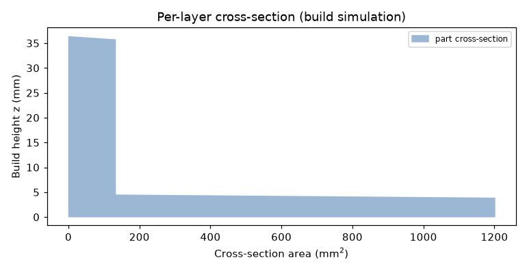

# Technical Report: Additive Build Advisor

## Overview

The Additive Build Advisor is a personal project I built to learn the
**design-to-inspection digital thread** for additive manufacturing end to end,
and to have a clean, extensible base I can keep developing. It ingests a part as
an STL mesh, recovers a watertight geometry, chooses a build orientation by
resting the part on candidate flat faces, simulates the build on a voxel model,
solves a finite-element **distortion analysis** with the inherent-strain method,
checks manufacturability (DfAM), turns the part's tolerances into an inspection
plan, and assembles a single machine-readable record with an explicit release
gate.

The aim is not a production build processor. It is to implement the whole
workflow myself, from first principles where that aids understanding and with an
established library where that is the right tool, so each step is transparent and
I can extend any piece later.


The STL parser, geometry kernel, voxelizer, orientation search, and build
simulation are written from scratch on `numpy`. The distortion FEA is assembled
and solved with **scikit-fem** (on `scipy`); `matplotlib` renders the figures.

## System architecture


The pipeline is: geometry recovery → orientation screening → voxelization → three
analyses on the voxel model (build simulation, distortion FEA, DfAM) plus an
inspection plan from the tolerances → a release gate → a digital-thread record
that can hand off to a runtime monitoring twin.

## Geometry and the voxelization engine

The STL is parsed (binary and ASCII), normals are recomputed from vertex winding
rather than trusted from the file, and the mesh volume is computed analytically
from the divergence theorem as a sum of signed tetrahedra over the $F$ facets,

$$
V \;=\; \frac{1}{6}\,\left|\sum_{f=1}^{F} \mathbf{a}_f \cdot \left(\mathbf{b}_f \times \mathbf{c}_f\right)\right|,
$$

where $\mathbf{a}_f,\mathbf{b}_f,\mathbf{c}_f$ are the vertices of facet $f$. A
watertight/manifold check welds coincident vertices and confirms every edge is
shared by exactly two facets.

A triangle soup is not a solid model, so the advisor builds an occupancy grid by
*ray stabbing*: for each $(x,y)$ column it shoots a vertical ray, collects the
$z$ heights where the ray crosses the mesh, sorts them, and fills voxels between
entry/exit pairs (the even–odd / crossing-number rule — a point is inside when a
ray to infinity crosses the surface an odd number of times). Per-axis grid jitter
keeps sample points off face diagonals, coincident crossings are de-duplicated so
the pairing stays correct on shared edges, and $z$ is sampled at voxel centres so
the discretised volume is unbiased. The grid drives the support, thin-wall,
trapped-void and per-layer cross-section estimates, and supplies the element mesh
for the FEA.

### Engine validation

The voxel/mesh volume error is reported on every run. For an axis-aligned cube
(10 mm, analytic $1000\ \text{mm}^3$) the discretisation is exact:

| grid_n | voxel volume (mm³) | error |
|---:|---:|---:|
| 16 | 1000.00 | 0.00% |
| 32 | 1000.00 | 0.00% |
| 64 | 1000.00 | 0.00% |

For an off-axis rotated bracket (analytic $8640\ \text{mm}^3$) it converges as the
grid refines, staying under ~0.4% even when coarse (+0.18%, +0.03%, −0.02% for
grid_n 24, 48, 96). A solid cube reports zero trapped volume and zero support; a
hollow box with a $216\ \text{mm}^3$ internal void recovers ~$220\ \text{mm}^3$ by
flood fill.

## Orientation: rest on a flat face

Orientation is the highest-leverage additive decision. Candidates are generated
the way a machinist chooses — *which face goes down* — by clustering the mesh's
facet normals into its significant flat faces and adding the six bounding-box
directions as a fallback, so every candidate rests a real face on the plate.

Each candidate is screened on a coarse voxelization and scored by a normalised,
weighted objective (lower is better),

$$
\text{score} \;=\; w_S\,\tilde{S} \;+\; w_c\,(1-\tilde{c}) \;+\; w_H\,\tilde{H} \;+\; P,
\qquad (w_S, w_c, w_H) = (0.45,\ 0.35,\ 0.20),
$$

where $\tilde{S}$ is the min–max normalised **support material volume**,
$\tilde{c}$ the **base-contact fraction** (footprint actually touching the
plate), $\tilde{H}$ the **build height**, and $P$ a hard penalty for orientations
that exceed the build volume. On the sample bracket the winner rests on the large
flat back face — full base contact and zero support — versus alternatives that
need more than $5\ \text{cm}^3$ of support on a tiny contact patch.


A note on a pitfall I hit: an earlier version scored orientation by overhang
*facet area* alone and chose a 45° edge-balanced tilt. It drove the overhang
metric to zero but was physically wrong — no flat base and large support.
Scoring the quantity that actually costs (support volume) plus base contact fixed
it. A metric that is cheap to game is the wrong metric.

## Build simulation

From the oriented mesh and grid, the simulation estimates the layer count and
build time,

$$
N_\text{layers} = \left\lceil \frac{H}{h} \right\rceil,
\qquad
t \;=\; \frac{V_\text{part} + V_\text{support}}{\dot{V}} \;+\; N_\text{layers}\, t_\text{recoat},
$$

with $H$ the build height, $h$ the layer height, $\dot{V}$ the effective
deposition/fusion rate, and $t_\text{recoat}$ the per-layer overhead; cost is
material mass times unit cost plus machine time times machine rate. Support
material is the support infill fraction times the empty volume that sits beneath
solid. The per-layer cross-section comes straight from the voxel grid:



These scale correctly across processes: the same bracket is ~160 layers and a few
dollars on FFF but ~1000 layers and a few hundred dollars on metal LPBF, driven by
the 0.03 mm layer height and the machine rate.

## Distortion FEA: the inherent-strain method

Distortion is predicted with a genuine finite-element solve, assembled and solved
with **scikit-fem** on a hexahedral mesh of 8-node trilinear elements (good for
bending, unlike linear tetrahedra). The constitutive law carries an eigenstrain
$\boldsymbol{\varepsilon}^{*}$ (the inherent strain that models the build's
accumulated thermal shrinkage),

$$
\boldsymbol{\sigma} = \mathbf{C} : \left(\boldsymbol{\varepsilon} - \boldsymbol{\varepsilon}^{*}\right),
\qquad
\lambda = \frac{E\nu}{(1+\nu)(1-2\nu)}, \quad \mu = \frac{E}{2(1+\nu)} .
$$

The weak form is: find $\mathbf{u}$ such that for all test fields $\mathbf{v}$,

$$
\int_{\Omega} \boldsymbol{\varepsilon}(\mathbf{v}) : \mathbf{C} : \boldsymbol{\varepsilon}(\mathbf{u})\,dV
\;=\;
\int_{\Omega} \boldsymbol{\varepsilon}(\mathbf{v}) : \mathbf{C} : \boldsymbol{\varepsilon}^{*}\,dV .
$$

For an isotropic eigenstrain $\boldsymbol{\varepsilon}^{*} = \varepsilon^{*}\mathbf{I}$ the
eigenstress is hydrostatic and the consistent load reduces to a divergence term,

$$
\sigma_0 = (3\lambda + 2\mu)\,\varepsilon^{*},
\qquad
\mathbf{f} = \int_{\Omega} \sigma_0\,\nabla\!\cdot\!\mathbf{v}\,dV ,
$$

giving the discrete system $\mathbf{K}\mathbf{u} = \mathbf{f}$, with the base layer
clamped to the plate ($\mathbf{u} = \mathbf{0}$ at $z\!=\!0$) and the sparse solve
performed by SciPy. The displacement field is the predicted distortion; clamping
the base while the bulk shrinks reproduces the corner-lift that dominates real
additive distortion. The element von Mises stress,

$$
\sigma_{vM} = \sqrt{\tfrac{1}{2}\!\left[(\sigma_x-\sigma_y)^2+(\sigma_y-\sigma_z)^2+(\sigma_z-\sigma_x)^2\right] + 3\left(\tau_{xy}^2+\tau_{yz}^2+\tau_{zx}^2\right)},
$$

is recovered for context. The result is drawn as a deformed element mesh
(exaggerated for visibility), contour-coloured by displacement magnitude:


A useful property: for an eigenstrain-only load (no external force) both
$\mathbf{K}$ and $\mathbf{f}$ scale linearly with $E$, so the displacement
$\mathbf{u} = \mathbf{K}^{-1}\mathbf{f}$ is **independent of Young's modulus** —
distortion is governed by geometry, eigenstrain and Poisson's ratio. $E$ only
enters the stress. That peak stress is linear-elastic and *indicative* only: with
no plasticity it can exceed yield, where a real part would yield and
stress-relieve. The distortion field is the meaningful output.

### Target process, basis, and prior art

This targets **metal laser powder-bed fusion (LPBF)**, where residual-stress
warpage is the governing failure mode. The inherent-strain method — calibrate an
eigenstrain (from Ueda's inherent-strain theory, adapted to AM) and apply it as a
static load to a part-scale elastic FEA — is the accepted part-scale approach and
what commercial tools (Netfabb, ANSYS Additive, Simufact) implement; see the
state-of-the-art review in *Int. J. Adv. Manuf. Technol.* (2022). The recognised
validation artifact is the **NIST AM-Bench 2018 (AMB2018-01)** single cantilever /
12-leg bridge, measured by CMM before and after EDM release. The repo includes the
cantilever geometry and an IN625 profile to run on it. For polymer processes the
same solver runs, but the record marks the result *indicative only*, since the
eigenstrain calibration is a metal-PBF notion.

### What the number means: on-plate vs post-release

This model holds the part **bonded to the plate** and reports the *on-plate*
distortion field. The NIST cantilever's headline ~1.0–1.3 mm is the
**post-release** deflection measured after the part is cut from the plate, when
stored residual stress relaxes into a large curl — a different, larger quantity.
The predicted on-plate cantilever distortion (~0.1 mm) is therefore not directly
comparable to that 1.3 mm, and the tool says so rather than forcing the match.
Capturing the post-release deflection needs a build-plate release/cutting step and
a calibrated (anisotropic, layer-activated) inherent strain — see "Where I'd take
it next."

### FEA validation

A prismatic bar clamped at the base under a uniform eigenstrain has an analytical
top displacement $u_\text{top} = |\varepsilon^{*}|\,H$. Refining the mesh, the FEA
converges toward it:

| voxel pitch (mm) | FEA peak distortion (mm) | error |
|---:|---:|---:|
| 4.0 | 0.4213 | +5.3% |
| 2.0 | 0.4161 | +4.0% |
| 1.0 | 0.4141 | +3.5% |
| 0.5 | 0.4132 | +3.3% |

(analytic axial value 0.400 mm for $\varepsilon^{*} = -0.01$, $H = 40$ mm). The
residual few percent is the lateral corner motion: the reported metric is the peak
displacement *magnitude*, which at the top corner adds in-plane shrinkage to the
axial component; the axial component itself converges to 0.400 mm. Running the
same bracket across every process confirms the displacement is linear in the
eigenstrain and independent of $E$ — exactly what linear elasticity requires for
an eigenstrain-only load:


## DfAM checks

Transparent, severity-ranked manufacturability rules read from the same grid,
simulation, and FEA as the headline numbers:

| Check | Method |
|---|---|
| Build-volume fit | bounding box vs machine envelope |
| Thin walls | morphological opening at the min-wall radius |
| Support burden | support material as a fraction of part volume |
| Aspect ratio | height / min footprint dimension |
| Trapped volume | flood fill from outside; unreachable voids are enclosed |
| Distortion | FEA peak displacement $\delta_\text{max}$ as a fraction $r = \delta_\text{max}/\max(\ell_x,\ell_y,\ell_z)$ |

## Inspection planning and process capability

The planner turns each toleranced dimension, GD&T control, and surface-finish
requirement into an inspection step, choosing a method by how tight the tolerance
is (calipers → micrometer → CMM → CT) and checking each tolerance against the
process's **as-built capability**. A tolerance below as-built capability is
flagged as needing post-machining, because inspecting to an impossible tolerance
only confirms a guaranteed failure. The tolerance spec is plain JSON, so the
design data stays CAD-neutral (a Fusion or STEP exporter would populate the same
fields).

## The release gate

The advisor never silently approves a build. It returns one of three decisions
with reasons and blocking findings attached:

| Decision | When |
|---|---|
| `release_to_build` | DfAM clean, tolerances within capability, simulation validated |
| `needs_engineering_review` | warnings, tolerances needing post-machining, or low simulation confidence (unsealed mesh / coarse-grid volume error) |
| `redesign_required` | a critical DfAM finding (does not fit, traps resin/powder, severe thin walls) |

A model may recommend, but a physical action is gated on evidence, on the
confidence of the model, and on a human-review path when anything is uncertain.
The record carries an explicit hand-off block so design intent can flow into
as-built monitoring. Worked outcomes from the sample run: **calibration_cube /
FFF** → `release_to_build`; **gantry_bracket / FFF** → `needs_engineering_review`
(±0.05 mm and 3.2 µm are below FFF capability → route to machining);
**hollow_housing / SLA** → `redesign_required` (enclosed cavity traps resin → add
drain holes).

## Validation summary

```bash
pytest                            # 10 tests
python examples/validate_fea.py   # regenerates the FEA validation figure
```

The tests cover: sample parts are watertight; STL round-trips; the cube
discretises exactly; an off-axis part's volume converges; trapped volume is
detected; the chosen orientation rests on a real face and is not the
highest-support candidate; the FEA matches the analytical clamped-bar solution
within 10%; distortion appears in the record; all three gate outcomes fire; and
the record is JSON-clean.

## Limitations

Stated plainly, because the value here is the workflow and the engineering, not
production fidelity. The tool does **not** include:

- A true slicer / toolpath generator (build time is volume- and layer-based).
- A calibrated transient thermo-mechanical solve. The FEA is a real linear-elastic
  solve, but the inherent strain is a representative per-process value, not fit to
  melt-pool thermal history.
- OEM-qualified material/machine profiles (numbers are representative defaults).
- A real CAD/CAM integration (geometry is STL; tolerances are JSON).
- Lattice/infill modeling, multi-part nesting, or layer-by-layer activation in the
  FEA (the eigenstrain is applied to the whole part at once).
- Validation against measured build outcomes.

## Where I'd take it next

1. A real slicer with toolpath-length-based time and proper support generation.
2. Layer-by-layer element activation and a calibrated inherent-strain (or transient
   thermo-mechanical) solve, validated against measured distortion, including a
   build-plate release step so post-release deflection can be compared to NIST.
3. Qualified per-machine process profiles and measured-vs-predicted calibration.
4. CAD/CAM integration (Fusion / STEP) to pull features, datums and PMI directly
   into the same record schema.
5. Closed-loop feedback: as-built inspection and in-situ monitoring updating the
   capability data and the eigenstrain calibration.
6. A persisted thread store linking design revision → build → inspection → part.
