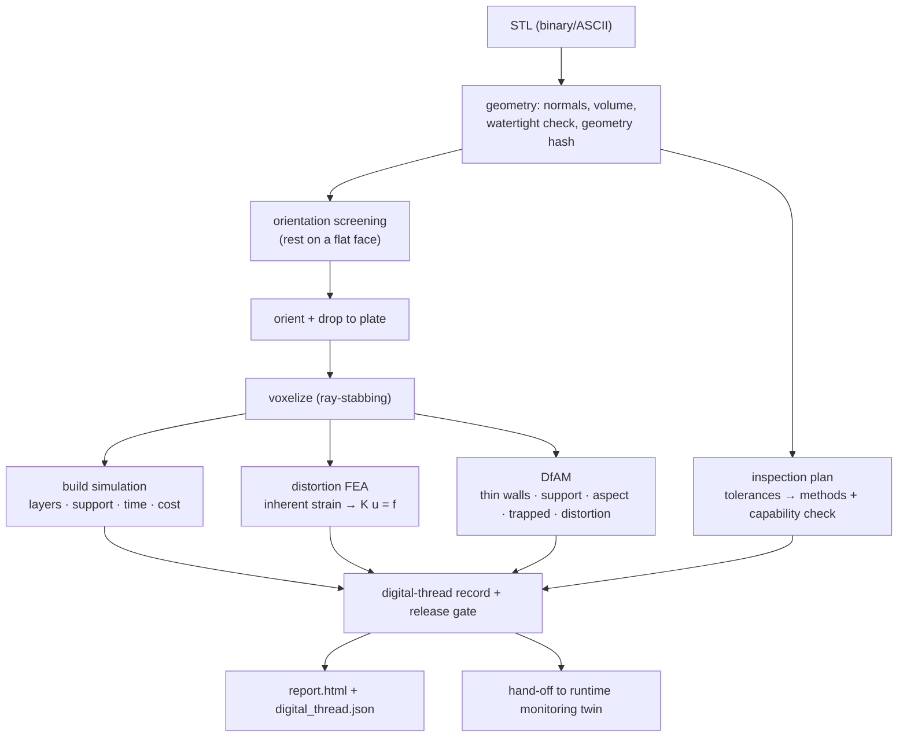

# Technical Report: Additive Build Advisor

## Executive summary

The Additive Build Advisor is a compact, design-to-inspection digital thread for
additive manufacturing. It ingests a part as an STL mesh, recovers a clean
geometry, chooses a build orientation by resting the part on candidate flat
faces, simulates the build on a voxel model, solves a finite-element
**distortion analysis** (the inherent-strain method), checks manufacturability,
turns the part's tolerances into an inspection plan, and assembles a single
machine-readable record with an explicit release gate.

The goal is not to be a production build processor. It is to demonstrate the
engineering workflow behind one, end to end and from first principles:

1. Recover geometry you can trust (parse, re-normal, verify watertightness).
2. Choose orientation physically (which flat face goes down), scored on real
   support volume, base contact, and height.
3. Simulate the build on a model you can *validate* against analytic volume.
4. Predict distortion with a real **finite-element** solve, validated against an
   analytical case.
5. Decide manufacturability with transparent DfAM rules.
6. Connect design tolerances to a concrete, capability-aware inspection plan.
7. Gate the physical action — release, review, or redesign — with the reasons.

## Why this project

It fills a specific gap: a runnable artifact that shows the **front half of the
digital thread** — design intent turning into a build decision — grounded in
real additive-manufacturing physics (orientation, support, FEA distortion, DfAM,
process capability) rather than a black-box model. It is built to hand off to a
separate runtime-monitoring twin (`mini-manufacturing-digital-twin`), so the two
together span design → build → monitor.

The package depends only on `numpy` (math) and `matplotlib` (report figures).
The STL parser, geometry kernel, voxelizer, orientation search, build simulation,
and FEA solver are all written from scratch so the engineering is legible.

## System architecture



## The voxelization engine

A triangle soup is not a solid model, so the advisor builds an occupancy grid by
*ray stabbing*: for each (x, y) column it shoots a vertical ray, collects where
it crosses the mesh, sorts the crossings, and fills voxels between entry/exit
pairs (the even-odd rule). Per-axis grid jitter prevents sample points from
landing on face diagonals; coincident-crossing de-duplication keeps the pairing
correct on shared edges; and z is sampled at voxel centers so the discretized
volume is unbiased. The grid drives support, thin-wall, trapped-void, and
per-layer cross-section estimates, and supplies the element mesh for the FEA.

### Engine validation

The voxel/mesh volume error is reported in every run and feeds the gate's
simulation confidence.

**Axis-aligned cube (10 mm, analytic 1000 mm³)** — lands exactly on the grid:

| grid_n | voxel volume | error |
|---:|---:|---:|
| 16 | 1000.00 | 0.00% |
| 32 | 1000.00 | 0.00% |
| 64 | 1000.00 | 0.00% |

**Off-axis rotated bracket (analytic 8640 mm³)** — converges as it refines,
staying under ~0.4% even when coarse (0.18% → 0.03% → −0.02% for grid_n 24 → 48
→ 96). A solid cube reports zero trapped/zero support; a hollow box with a
216 mm³ void recovers ~220 mm³ by flood fill.

## Orientation: rest on a flat face

Orientation is the highest-leverage additive decision, so it deserves a
physically meaningful search. Candidates are generated the way an engineer
chooses — *which face goes down* — by clustering the mesh's facet normals into
its significant flat faces and adding the six bounding-box directions as a
fallback. Every candidate therefore rests a real face on the plate; there are no
degenerate edge-balanced orientations.

Each candidate is screened on a coarse voxelization and scored on:

- **support material volume** (minimize) — the dominant cost/quality driver;
- **base-contact area** (maximize) — large flat footprint = adhesion + stability;
- **build height** (minimize) — drives build time;

with a hard penalty for any orientation that exceeds the build volume. On the
sample bracket, the winner rests on the large flat back face: full base contact
and **zero support**, versus alternatives that need >5 cm³ of support on a tiny
contact patch. The cheap coarse screen ranks the candidate set; the full
simulation and FEA then run once, on the winner.

> An earlier version scored orientation only by overhang *facet area* and chose a
> 45° edge-balanced tilt — it drove the overhang metric to zero but was
> physically nonsense (no flat base, huge support). Scoring by real support
> volume and base contact fixed it. The lesson — a metric that is cheap to game
> is the wrong metric — is itself worth discussing.

## Distortion FEA: the inherent-strain method

Distortion is predicted with a genuine finite-element solve, not a heuristic:

- each occupied voxel becomes an 8-node trilinear hexahedral element (24 DOF);
- the accumulated thermal shrinkage of the build is modeled as a uniform
  **eigenstrain** (inherent strain) applied to every element;
- the base layer is clamped to the build plate;
- equilibrium ``K u = f`` is solved **matrix-free** with a Jacobi-preconditioned
  conjugate gradient — the element operator is identical on a regular grid, so no
  global sparse matrix is assembled.

The displacement field is the predicted distortion; its peak magnitude is the
warpage estimate. Clamping the base while the bulk shrinks reproduces the
corner-lift that dominates real additive distortion. This is the standard
reduced-order approach used by Netfabb and ANSYS Additive.

A subtlety worth stating: for an eigenstrain-only load (no external force), the
*displacement* field is independent of Young's modulus (it cancels between
``K`` and ``f``), so distortion is governed by geometry, eigenstrain, and
Poisson's ratio. Young's modulus only enters the stress field (peak von Mises is
reported separately). That peak stress is linear-elastic and *indicative* only:
with no plasticity in the model it can exceed the material yield, where a real
part would yield and stress-relieve. The distortion field is the meaningful
output; the stress is a relative flag.

### FEA validation

**Analytical clamped bar.** A prismatic bar clamped at the base under uniform
eigenstrain ε\* has an analytical top displacement |ε\*|·H. Refining the mesh,
the FEA converges toward it:

| voxel pitch | FEA peak distortion | error |
|---:|---:|---:|
| 4.0 mm | 0.4213 mm | +5.3% |
| 2.0 mm | 0.4161 mm | +4.0% |
| 1.0 mm | 0.4141 mm | +3.5% |
| 0.5 mm | 0.4132 mm | +3.3% |

(analytic axial value 0.400 mm for ε\* = −0.01, H = 40 mm). The residual few
percent is the lateral corner motion — the reported metric is the peak
displacement *magnitude*, which at the top corner includes the in-plane
shrinkage on top of the axial component; the axial component itself converges to
0.400 mm.

**Eigenstrain linearity / E-independence.** Running the same bracket across every
process, predicted distortion scales linearly with the inherent strain and is
independent of Young's modulus — ABS (ε\* = −0.012) gives 0.602 mm, exactly twice
PLA's 0.302 mm (ε\* = −0.006), and metal Ti-6Al-4V (E = 110 GPa) and polymer PLA
(E = 3.5 GPa) sit purely where their eigenstrains place them. That linear,
E-independent response is exactly what linear elasticity requires for an
eigenstrain-only load, and is the second validation that the solver is correct.

## Build simulation

From the oriented mesh and grid, the simulation estimates layer count (from the
real layer height), support material (support infill × the empty volume sitting
under solid), build time (deposition + per-layer recoat/peel overhead), and cost
(material + amortized machine time). These scale correctly across processes: the
same bracket is ~160 layers and a few dollars on FFF but ~1000 layers and a few
hundred dollars on metal LPBF, driven by the 0.03 mm layer height and machine
rate.

## DfAM checks

Transparent, severity-ranked manufacturability rules, all reading from the same
grid, simulation, and FEA as the headline numbers:

| Check | Method |
|---|---|
| Build-volume fit | bounding box vs machine envelope |
| Thin walls | morphological opening at the min-wall radius |
| Support burden | support material as a fraction of part volume |
| Aspect ratio | height / min footprint dimension |
| Trapped volume | flood fill from outside; unreachable voids are enclosed |
| Distortion | FEA peak displacement as a fraction of the part's largest dimension |

## Inspection planning and process capability

The planner turns each toleranced dimension, GD&T control, and surface-finish
requirement into an inspection step with a method and equipment chosen by how
tight the tolerance is (calipers → micrometer → CMM → CT), and checks each
tolerance against the process's **as-built capability** — flagging any tolerance
that needs post-machining, because inspecting to an impossible tolerance only
confirms a guaranteed failure. The tolerance spec is plain JSON, so the design
data stays CAD-neutral (a Fusion or STEP exporter would populate the same
fields).

## The release gate (verify before act)

The advisor never silently approves a build. It returns one of three decisions
with reasons and blocking findings attached:

| Decision | When |
|---|---|
| `release_to_build` | DfAM clean, tolerances within capability, simulation validated |
| `needs_engineering_review` | warnings, tolerances needing post-machining, or low simulation confidence (unsealed mesh / coarse-grid volume error) |
| `redesign_required` | a critical DfAM finding (does not fit, traps resin/powder, severe thin walls) |

This is the same verify-before-act discipline used in the companion runtime
monitoring twin and in prior robotic-manipulation work: a model may recommend,
but a physical action is gated on evidence, on the confidence of the model, and
on a human-review path when anything is uncertain. The record carries an explicit
hand-off block so design intent flows into as-built monitoring.

Worked outcomes from the sample run: **calibration_cube / FFF** → `release_to_build`;
**gantry_bracket / FFF** → `needs_engineering_review` (±0.05 mm and 3.2 µm are
below FFF capability → route to machining); **hollow_housing / SLA** →
`redesign_required` (enclosed cavity traps resin → add drain holes).

## Validation summary

```bash
pytest                       # 10 tests
python tests/test_smoke.py   # -> "Smoke test passed"
python examples/validate_fea.py   # regenerates the FEA validation figure
```

The tests cover: sample parts are watertight; STL round-trips; the cube
discretizes exactly; an off-axis part's volume converges; trapped volume is
detected; the chosen orientation rests on a real face and is not the
highest-support candidate; the FEA matches the analytical clamped-bar solution
within 10%; distortion appears in the record; all three gate outcomes fire; and
the record is JSON-clean.

## Limitations

This prototype is intentionally scoped. It does **not** include:

- A true slicer / toolpath generator (build time is volume- and layer-based).
- A calibrated transient thermo-mechanical solve. The FEA is a real linear-
  elastic solve, but the inherent strain is a representative per-process value,
  not fit to melt-pool thermal history.
- OEM-qualified material/machine profiles (numbers are representative defaults).
- A real CAD/CAM integration (geometry is STL; tolerances are JSON).
- Lattice/infill modeling, multi-part nesting, or layer-by-layer activation in
  the FEA (the eigenstrain is applied to the whole part at once).
- Validation against measured build outcomes.

These limits are stated plainly because the value here is the architecture and
the engineering judgment, not a claim of production fidelity.

## Production extension plan

1. A real slicer with toolpath-length-based time and proper support generation.
2. Layer-by-layer element activation and a calibrated inherent-strain (or
   transient thermo-mechanical) solve, validated against measured distortion.
3. Qualified per-machine process profiles and measured-vs-predicted calibration.
4. CAD/CAM integration — Fusion 360 / Autodesk Platform Services or STEP — to
   pull features, datums, and PMI directly into the same record schema.
5. Closed-loop feedback: as-built inspection and in-situ monitoring flowing back
   to update capability data and the eigenstrain calibration.
6. A persisted thread store linking design revision → build → inspection → part.

## Interview explanation

"I built this for the front half of a digital thread — design intent turning
into a build decision — grounded in real additive physics. It takes an STL,
picks a build orientation by resting the part on its flat faces and scoring real
support volume and base contact, simulates the build on a voxel model I validate
against analytic volume, and predicts distortion with an actual finite-element
solve: a linear-elastic voxel FEM using the inherent-strain method, clamped at
the plate, solved matrix-free. I validated the FEA against the analytical
clamped-bar case and confirmed the distortion is linear in eigenstrain and
E-independent, which is what the theory demands. Then DfAM and inspection-
capability checks feed a gate that decides release, review, or redesign. I kept
the eigenstrain a representative value rather than pretending it's a calibrated
transient thermo-mechanical solve — I've run the production FEA and I'm precise
about what this is and isn't."

## Strong follow-up line

"The orientation step is a good example of how I work. My first version scored it
by overhang facet area and it picked a 45° edge-balanced tilt — mathematically
zero overhang, physically absurd. The fix was to score the thing that actually
costs money: support volume and base contact from a real voxelization. A metric
that's cheap to game is the wrong metric, and catching that is exactly the
judgment this kind of applied research needs."
